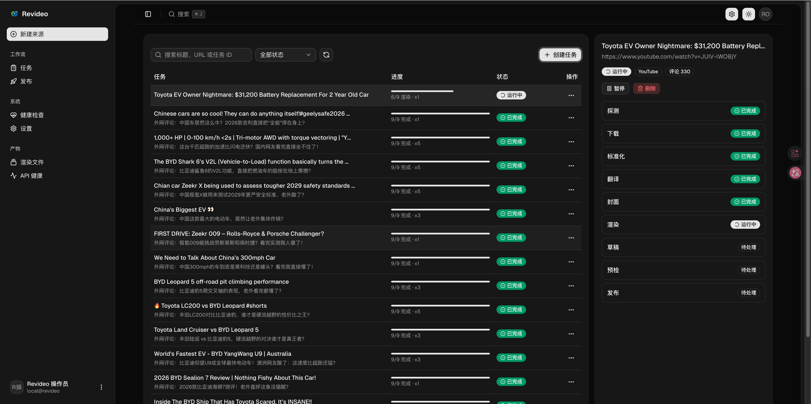
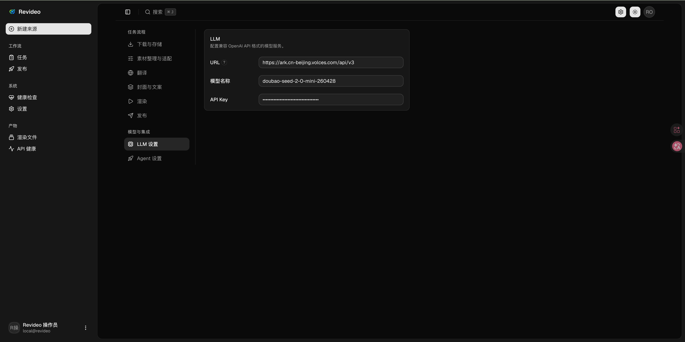

# Revideo

一键将海外视频（YouTube、TikTok）搬运到国内（B站、小红书、抖音）！

源平台 → 标准化资源 → 处理流水线 → 目标平台



## 一键安装

**Linux / macOS：**

```bash
curl -fsSL https://raw.githubusercontent.com/Match-Yang/revideo-server/main/install.sh | bash
```

**Windows (PowerShell)：**

```powershell
iex (irm https://raw.githubusercontent.com/Match-Yang/revideo-server/main/install.ps1)
```

安装脚本会自动：
- 安装 Node.js 22+、yt-dlp、ffmpeg/ffprobe（如缺失）
- 下载对应平台的预编译包
- 注册系统服务（开机自启）
- 启动服务，端口 3001

安装完成后打开 http://localhost:3001 即可使用 Dashboard。

**卸载：**

**Linux / macOS：**
```bash
curl -fsSL https://raw.githubusercontent.com/Match-Yang/revideo-server/main/install.sh | bash -s -- --uninstall
```

**Windows (PowerShell)：**
```bash

iex (irm https://raw.githubusercontent.com/Match-Yang/revideo-server/main/install.ps1); Install-Revideo -Uninstall
```

<details>
<summary>手动安装</summary>

**前置依赖**

- Node.js >= 22
- [yt-dlp](https://github.com/yt-dlp/yt-dlp)
- [ffmpeg](https://ffmpeg.org/) + ffprobe
- Chrome 或 Chromium（用于浏览器自动化发布，可选）

**步骤**

```console
git clone https://github.com/Match-Yang/revideo-server.git
cd revideo-server
npm install
npm run build
npm start
```

打开 http://localhost:3001。

</details>

## 开发

```console
npm install
npm run dev            # API (:3001) + Dashboard 开发服务器
npm run build          # 编译 TypeScript → dist/
npm run lint           # eslint + tsc 类型检查
```

## 配置翻译

在 Dashboard 的设置页面中配置 LLM：填写兼容 OpenAI API 格式的 URL、模型名称和 API Key。Thinking 默认关闭。


## MCP（供 AI agent 接入）

Revideo 内置 MCP（Model Context Protocol）服务，AI agent（如 Claude）可通过它自动化整个搬运流程：提交链接 → 翻译/渲染/生成草稿 → 发布，全程无需手动操作 Dashboard。

**端点**：`POST http://localhost:3001/mcp`（无状态 Streamable HTTP 传输）

在 Claude Desktop / Claude Code 的 MCP 配置中加入：

```json
{
  "mcpServers": {
    "revideo": {
      "url": "http://localhost:3001/mcp"
    }
  }
}
```

接入后可调用以下工具：

| 工具 | 说明 |
| --- | --- |
| `submit_video_job` | 提交源视频链接并自动跑完整流水线（下载 → 翻译 → 渲染 → 生成草稿 → 可选发布），立即返回 jobId（异步执行） |
| `get_job` | 查询某个 job 的状态、进度、各平台发布结果与输出路径（用于轮询） |
| `list_jobs` | 列出最近的 job（精简摘要） |
| `get_job_events` | 查看 job 的事件日志（用于排查失败原因） |
| `list_platforms` | 列出支持的源平台与目标平台 |
| `cancel_job` | 取消某个 job 排队中或进行中的任务 |

示例：让 agent 把一个 YouTube 视频搬运并发布到 B 站，只需调用 `submit_video_job`（传入 `url` + `targets: ["bilibili"]` + `publishAction: "publish"`），再用 `get_job` 轮询直到完成即可。

## 联系我

如果有疑问或者需要技术支持的，可以联系我。


## License

MIT
